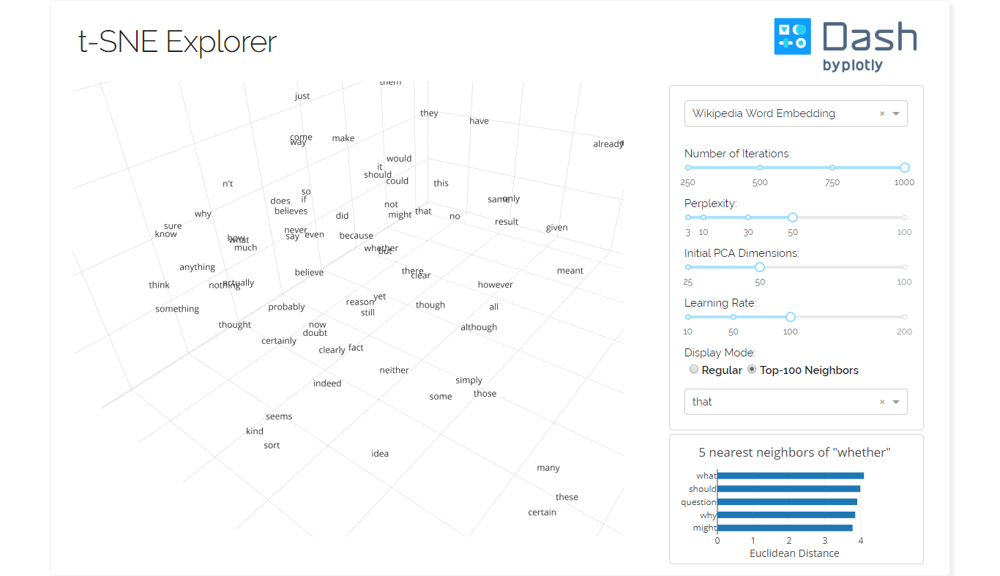

# t-SNE Explorer

This is a demo of the Dash interactive Python framework developed by [Plotly](https://plot.ly/).

Dash abstracts away all of the technologies and protocols required to build an interactive web-based application and is a simple and effective way to bind a user interface around your Python code.

To learn more check out our [documentation](https://plot.ly/dash). For an introductory and extensive explanation of t-SNE how to use it properly, please check out the [demo app](https://dash-tsne.herokuapp.com/).

## What is t-SNE?

t-distributed stochastic neighbor embedding, created by van der Maaten and Hinton in 2008, is a visualization algorithm that reduce a high-dimensional space (e.g. an image or a word embedding) into two or three dimensions, facilitating visualization of the data distribution. 

A classical example is MNIST, a dataset of 60,000 handwritten digits, 28x28 grayscale. Upon reducing the set of images using t-SNE, you can see all the digit clustered together, with few outliers caused by poor calligraphy. [You can read a detailed explanation of the algorithm on van der Maaten's personal blog.](https://lvdmaaten.github.io/tsne/)

## How to use the local app

Get started by cloning this repo, and run `app.py`. To train your own t-SNE algorithm, input a high-dimensional dataset with only numerical values, and the corresponding labels inside the upload fields. For convenience, small sample datasets are included inside the data directory. [You can also download them here](https://www.dropbox.com/sh/l79mcmlqil7w7so/AACfQhp7lUS90sZUedsqAzWOa?dl=0&lst=). The training can take a lot of time depending on the size of the dataset (the complete MNIST dataset could take 15-30 min), and it is not advised to refresh the webpage when you are doing so.

## Generating data

`generate_data.py` is included to download, flatten and normalize datasets, so that they can be directly used in this app. It uses keras.datasets, which means that you need install keras. To use the script, simply go to the path containing it and run in terminal:

```python generate_data.py [dataset_name] [sample_size]```

which will create the csv file with the corresponding parameters. At the moment, we have the following datasets:
* MNIST
* CIFAR10
* Fashion_MNIST

## Screenshots
The following are screenshots for the demo app:




The following are screenshots for the full (local) app:


