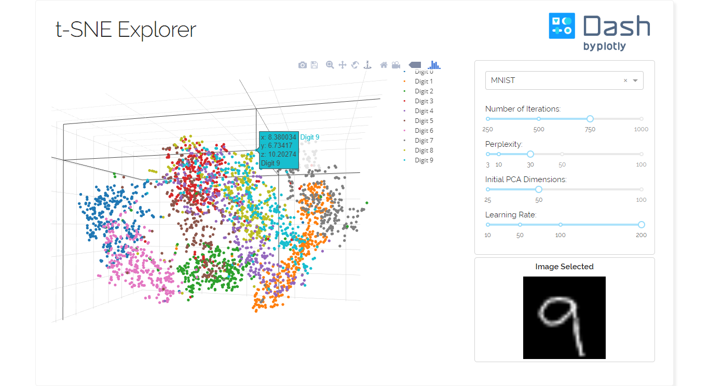
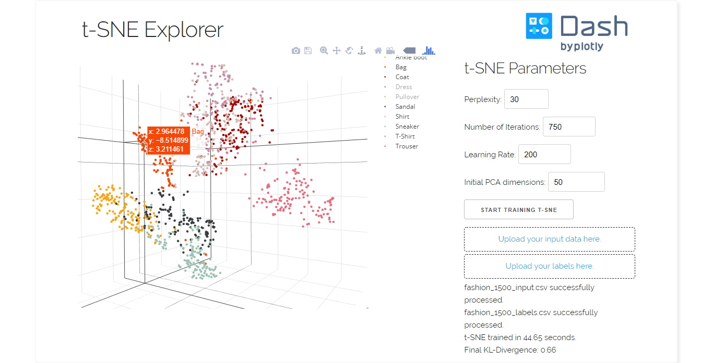

# t-SNE Explorer Demo App

This is a demo of the Dash interactive Python framework developed by [Plotly](https://plot.ly/).

Dash abstracts away all of the technologies and protocols required to build an interactive web-based application and is a simple and effective way to bind a user interface around your Python code.

To learn more check out our [documentation](https://plot.ly/dash).

**What is t-SNE?**

t-distributed stochastic neighbor embedding, created by van der Maaten and Hinton in 2008, is a visualization algorithm that reduce a high-dimensional space (e.g. an image or a word embedding) into two or three dimensions, so we can visualize how the data is distributed. A classical example is MNIST, a dataset of 60,000 handwritten digits of size 28x28 in black and white. When you reduce the MNIST dataset using t-SNE, you can clearly see all the digit clustered together, with the exception of a few that might have been poorly written. [You can read a detailed explanation of the algorithm on van der Maaten's personal blog.](https://lvdmaaten.github.io/tsne/)

**How to use the app**

To train your own t-SNE, you can input your own high-dimensional dataset and the corresponding labels inside the upload fields. For convenience, small sample datasets are included inside the data folder. [You can also download them here](https://www.dropbox.com/sh/l79mcmlqil7w7so/AACfQhp7lUS90sZUedsqAzWOa?dl=0&lst=). The training can take a lot of time depending on the size of the dataset (the complete MNIST dataset could take 15-30 min), so it is **recommended to clone the repo and run the app locally if you want to use bigger datasets**. [You can find the repository containing this model here.](https://github.com/plotly/dash-tsne)

**Generating data**

`generate_data.py` is included to download, flatten and normalize datasets, so that they can be directly used in this app. It uses keras.datasets, which means that you need install keras. To use the script, simply go to the path containing it and run in terminal:

```python generate_data.py [dataset_name] [sample_size]```

which will create the csv file with the corresponding parameters. At the moment, we have the following datasets:
* MNIST
* CIFAR10
* Fashion_MNIST


The following are screenshots for the demo app:



The following are screenshots for the full (local) app:


